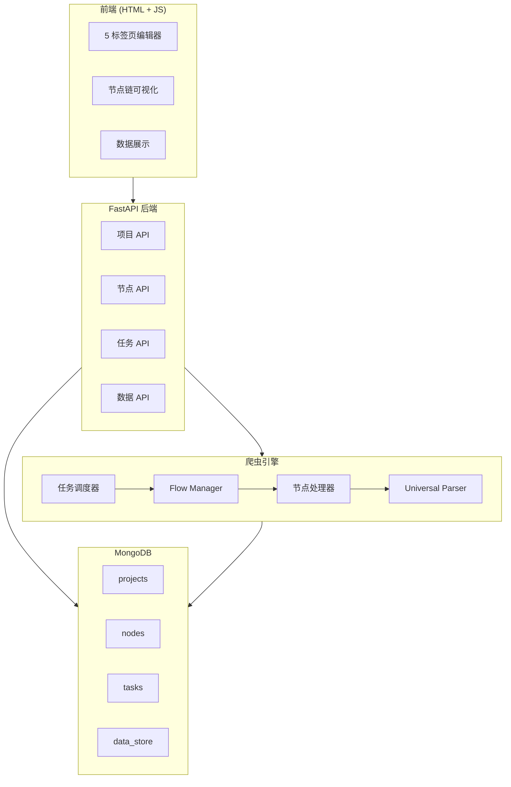
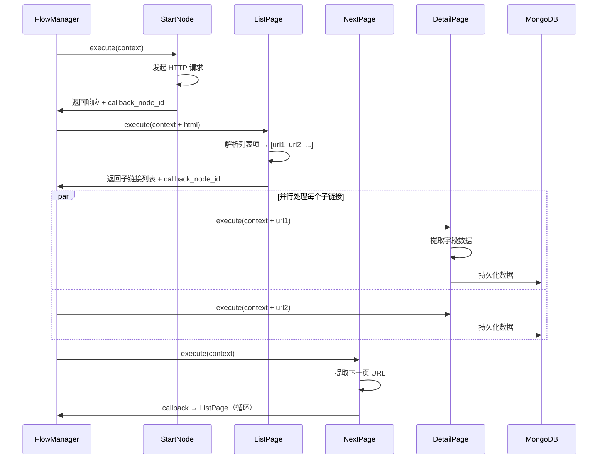

# RuleCrawl — 可视化规则爬虫系统

RuleCrawl 是一个现代化的、基于规则的可视化爬虫采集平台。用户无需编写代码，只需通过友好的 Web 界面配置 5 种类型的节点（起始页、中间页、列表页、下一页、详情页），即可编排复杂的采集工作流。

## ✨ 核心特性

-   **可视编排**：独创的 5 标签页节点流设计，直观管理采集逻辑。
-   **全能解析**：支持 XPath、CSS Selector、**JsonPath**、Regex 多种解析方式。
-   **动态采集**：支持 API JSON 数据直接透传 (`data://` 协议)，无需二次请求。
-   **即时反馈**：支持节点链可视化预览，实时查看数据流向。
-   **高性能**：基于 FastAPI (ASGI) + Motor (Async MongoDB) 的全异步架构。
-   **数据管理**：内置数据查看器，支持 JSON 格式化预览与导出。

## 🏛️ 系统架构



## 🔄 数据流转 (节点执行时序)



## 🛠️ 技术栈

-   **后端**: Python 3.9+, FastAPI, Motor (MongoDB Driver), HTTPX, Parsel/Lxml
-   **前端**: 原生 HTML5/CSS3 (Glassmorphism UI), Vanilla JS
-   **数据库**: MongoDB 4.4+

## 🚀 快速开始

### 1. 环境准备

确保已安装 Python 3.9+ 和 MongoDB。

### 2. 安装依赖

本项目使用 `pyproject.toml` 管理依赖。

```bash
# 安装依赖
pip install .

# 或者直接安装开发依赖
pip install -e .
```

### 3. 配置环境

复制 `.env.example` (如有) 或直接创建 `.env` 文件：

```ini
MONGODB_URL=mongodb://localhost:27017
DB_NAME=rulecrawl
```

### 4. 启动服务

```bash
uvicorn app.main:app --reload --port 8000
```

访问浏览器：[http://localhost:8000](http://localhost:8000)

## 📖 使用指南

### 基本流程

1.  **新建项目**：填写项目名称。
2.  **配置起始页**：输入目标网站 URL。
3.  **配置列表页**：
    -   设定列表项选择器（支持 XPath/JsonPath）。
    -   设定链接提取规则（若采集 API JSON，可留空链接选择器以触发**数据透传模式**）。
4.  **配置详情页**：
    -   定义字段（标题、内容、时间等）。
    -   系统自动调度执行。
5.  **启动任务**：点击侧边栏“启动采集任务”。
6.  **查看数据**：在项目列表页点击“数据”按钮查看结果。

### 高级功能：API JSON 采集

针对返回 JSON 数据的 API（如 App 接口）：
1.  **Start Node**: 设置 API URL。
2.  **List Node**:
    -   Parser Type: `jsonpath`
    -   Item Selector: `$.data.list[*]`
    -   **Link Selector**: *留空*
3.  **Detail Node**:
    -   Parser Type: `jsonpath`
    -   Fields: `title` -> `$.title`

系统会自动通过 `data://` 协议传递数据，实现零额外请求的高效采集。

## 📄 许可证

MIT License
